# JQuickCart - Flutter Firebase E-Commerce App

JQuickCart is a Flutter and Dart based e-commerce mobile app connected with Firebase. It includes product browsing, wishlist, cart management, user authentication, and a smooth shopping experience.

## App Screenshots

  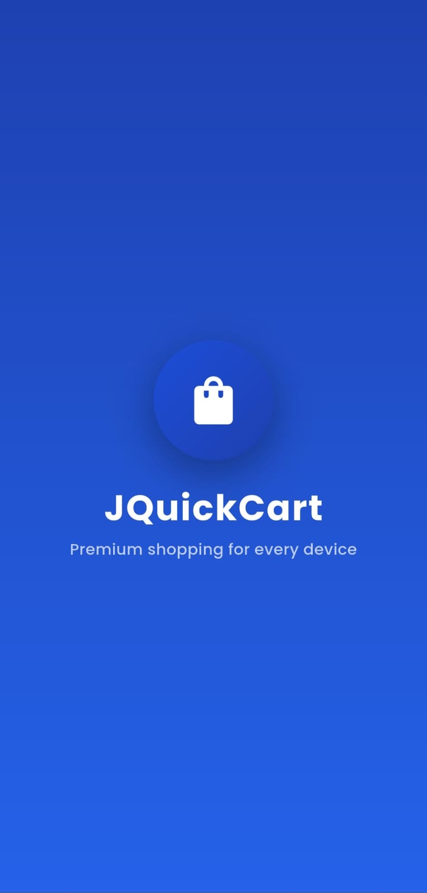
  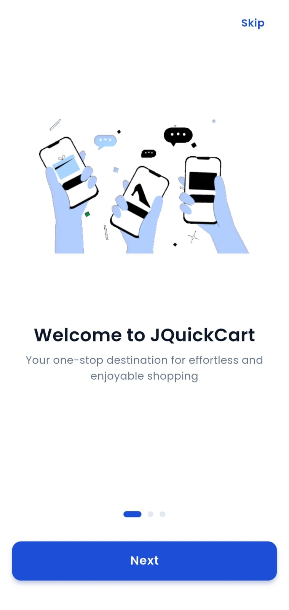
  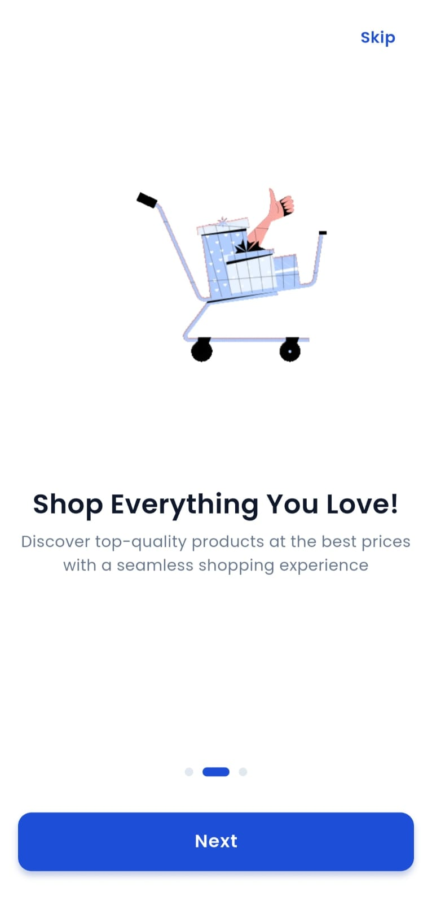

  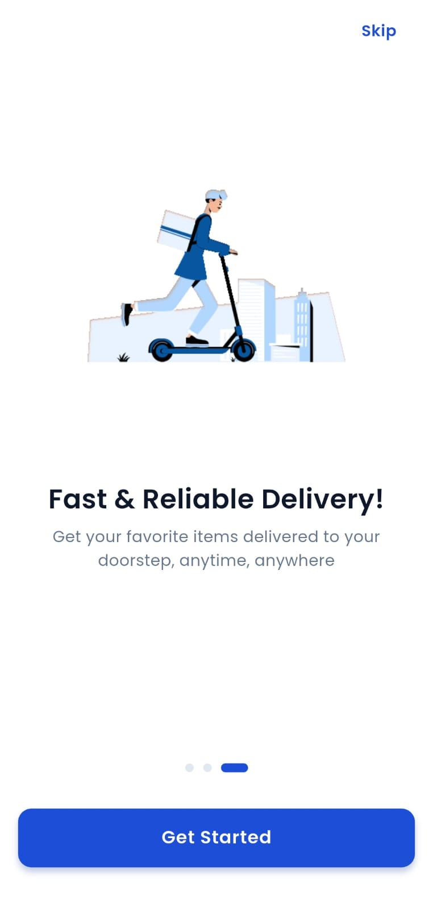
  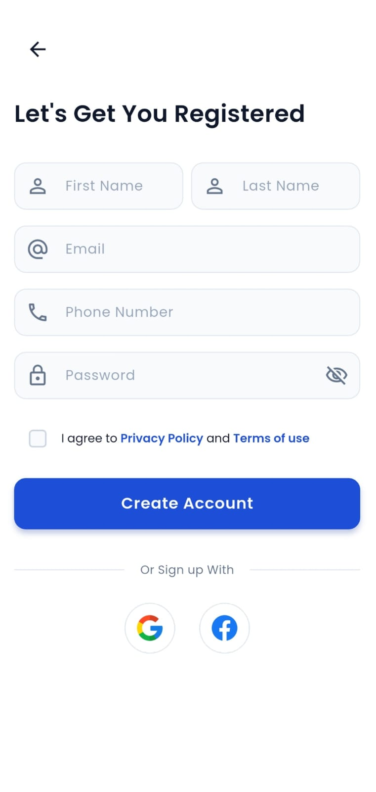
  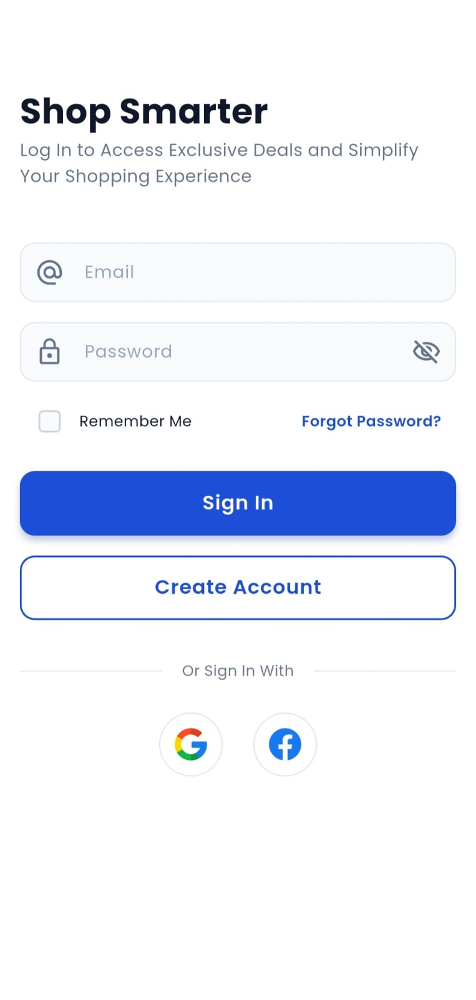

  
  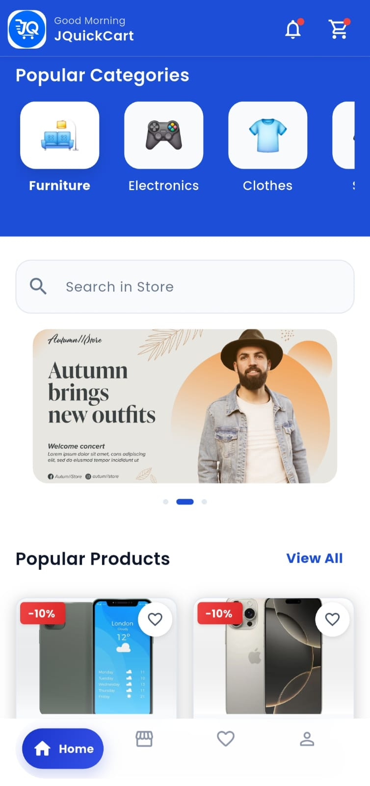
  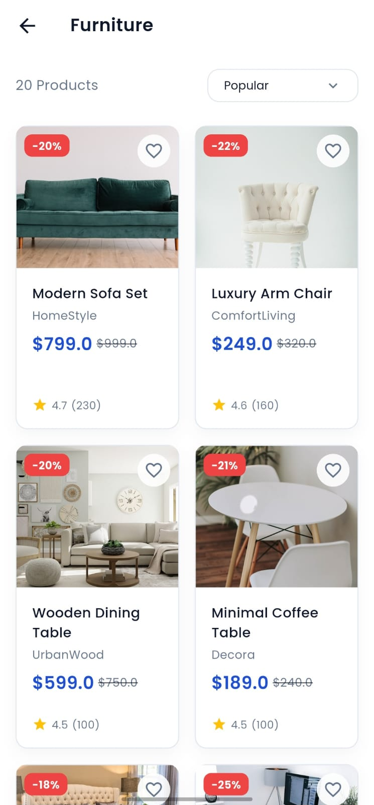

  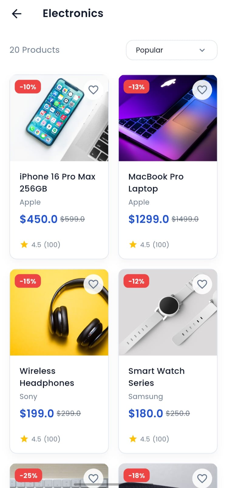
  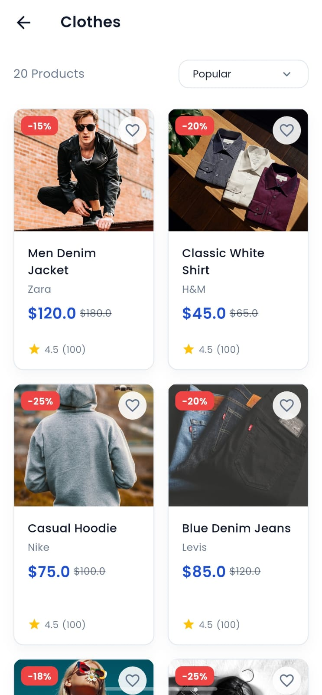
  

  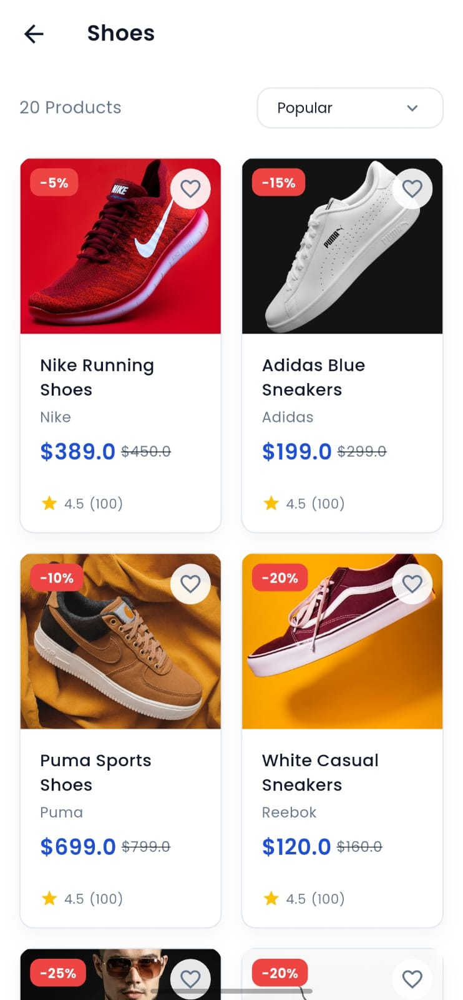
  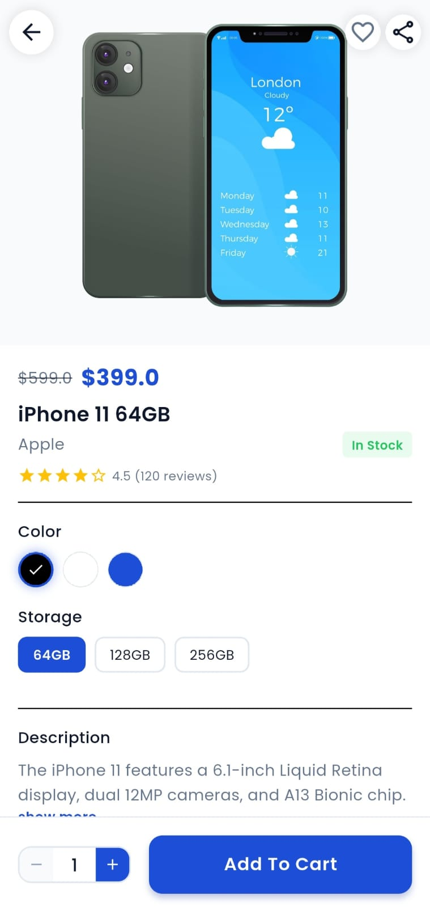
  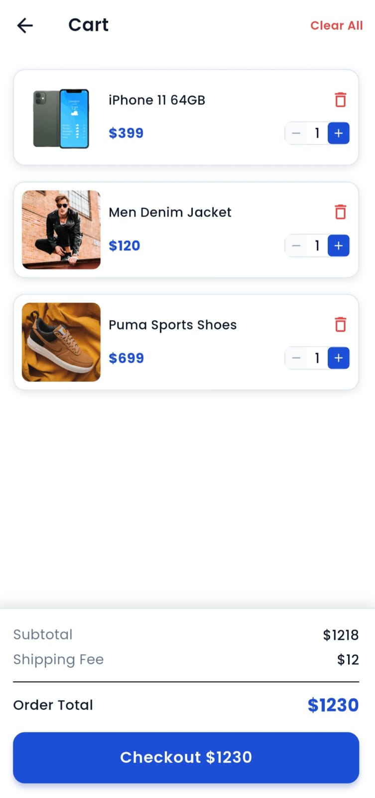

  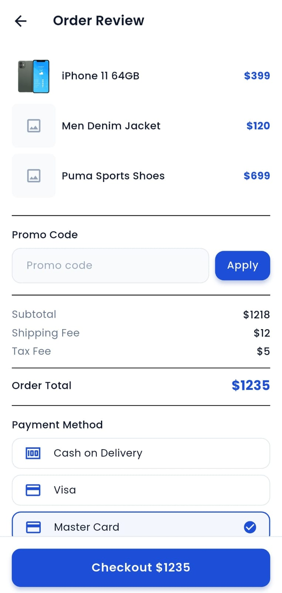
  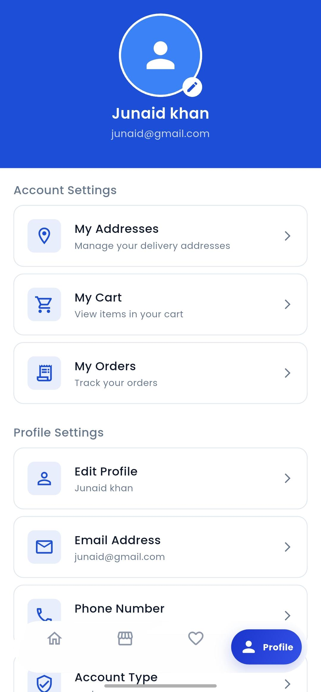

## Features

- Flutter and Dart based mobile app
- Firebase connected backend
- User authentication
- Product browsing
- Wishlist feature
- Cart management
- Checkout flow
- Clean and modern UI

## Tech Stack

| Technology | Purpose                            |
| ---------- | ---------------------------------- |
| Flutter    | Mobile app development             |
| Dart       | Programming language               |
| Firebase   | Authentication and backend support |
| GitHub     | Code hosting and version control   |

## Project Status

This project is currently under development.
